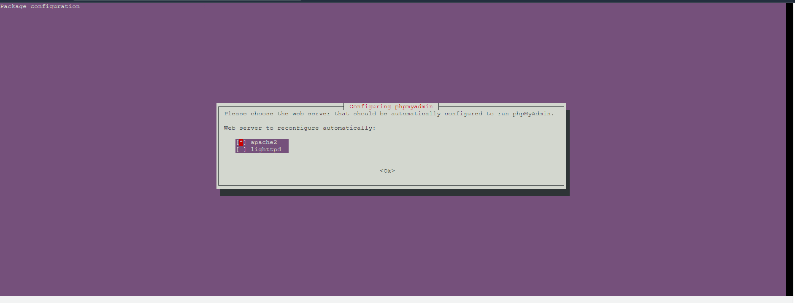
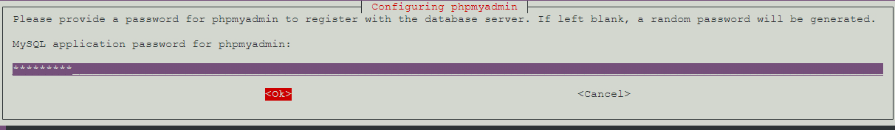

# Actividad 13 LAMP
### Instaalcion de apache2 y PhP
1. Instalar apache y comprobar. 
   ```
      apt install apache2 -y 
      apache2 -v
    ```
   

3. Instalar PHP
   
   ```
   apt install php libapache2-mod-php php-mysql -y
   ```
    

4. Editar el sitio por defecto de apache.
   ```
   cd /etc/apache2/sites-avialble
   nano 000-deafult.conf
   ```
   Debe quedar como se en la siguiente imagen.
    

5. Reiniciar el servicio apache2.
   ```
   systemctl restart apache2
   ```

6. Comprobar instalacion de apache y php.
   Crearemos una pagina de prueba en la ruta de sito web por defecto.
   ```
   cd /var/www/html
   echo "<?php phpinfo(); ?>" > info.php
   ``` 
   

7. Acceder a la pagina de pueba que hemos creado. En el navegador poner la ip publica de nuestra maquina de AWS y el nombre la pagina que hemos creado. En este caso es 54.89.229.25/info.php.
   
    

### Instalacion y configuracion MariaDB
1. Instalar el servidor de base de datos y el cliente
   ```
   apt install -y mariadb-server mariadb-client
   ```
   
2. Accder a MariaDB como root.
   ```
   mariadb -u root
   ```
   
3. Cambiar la contraseña de root.
   ```
   ALTER USER 'root'@'localhost' identified BY 'alumno203';
   flush privileges;
   exit;
   ```
   
   

### Instalacion de PhPMyAdmin en LAMP
1. Instalar PhPMyAdmin
   ```
   apt install phpmyadmin php-mbstring php-zip php-gd php-json php-curl -y 
   ```
   
2. Dutrante el proceso hay que elegir apache2 como servidor web.
   
3. Confirmar que se quiere utilizar dbconfig-common para configurar la base de datos.
   
4. Escribir la contraseña que queremos usar para acceder a PhPMyAdmin. En este caso sera alumno203.
   
5. Acceder a PhPMyAdmin escribiendo la ip publica de nuestra maquina seguido de phpmyadmin. Por ejemplo: 54.89.229.25/phpmyadmin/
   

### Resultado final
- http://servidor_AWS/

- http://servidor_AWS/info.php

 Nota: Estas dos ultimas capturas de pantalla estan tomadas de una maquina virtual Ubuntu ya que en la maquina de AWS esta instalado ya el Wordpress.